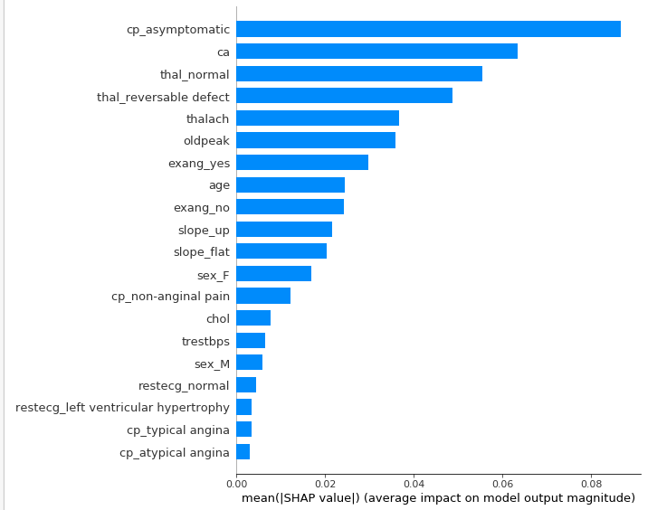

# Feature Importance
There are many ways to determine how important each feature is in our Random Forest Classifier model.

## 1. Permutation Importance
We start off with one of the easiest, widely used methods to determine the weights of each feature in the fitted model.

How permutation importance works is we shuffle the feature values of a single column within the dataframe and make new predictions, then we calculate the loss between the new and old predictions.

We can see exactly which features this method determines is most important below

| Weight        | Feature           |
|:-------------:|:-------------:|
| 0.0233 ± 0.0267 | ca |
| 0.0233 ± 0.0163 | thal_normal |
| 0.0167 ± 0.0422 | thal_reversable defect |
| 0.0133 ± 0.0389 | cp_asymptomatic |
| 0.0100 ± 0.0499 | oldpeak |
| 0.0067 ± 0.0267 | slope_flat |
| 0.0067 ± 0.0163 | sex_F |
| 0.0033 ± 0.0249 | slope_up |
| 0.0033 ± 0.0249 | exang_yes |
| 0 ± 0.0000 | chol |
| 0 ± 0.0000 | cp_atypical angina |
| 0 ± 0.0000 | fbs_<= 120mg/dl |
| 0 ± 0.0000 | fbs_> 120mg/dl |
| 0 ± 0.0000 | restecg_ST-T wave abnormality |
| 0 ± 0.0000 | restecg_left ventricular hypertrophy |
| 0 ± 0.0000 | slope_down |
| 0 ± 0.0000 | restecg_normal |
| 0 ± 0.0000 | cp_typical angina |
| -0.0033 ± 0.0389 | thalach |
| -0.0033 ± 0.0133 | trestbps |
| … 5 more … |

## 2. SHAP (SHapley Additive exPlanations)
SHAP allows us to provide insights on our blackbox model on an individual prediction. It shows us the impact of a certain value from a feature compared to the impact if we provided a baseline value.

We provide a summary bar plot to show the results below.

(Optional) We can see that the top 6 features from both methods coincide with one another.